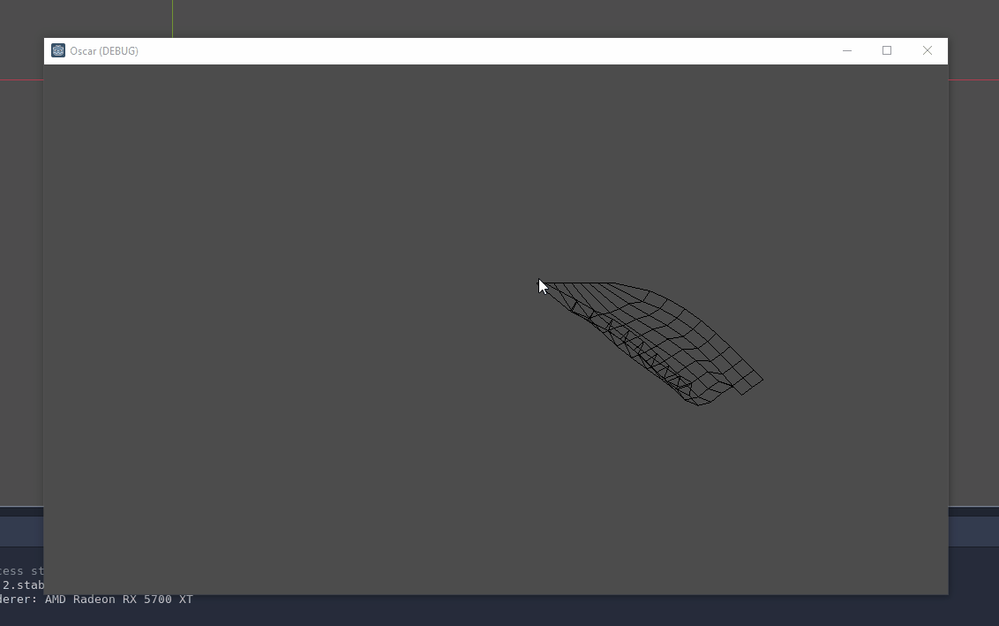

# 2D cloth simulation in godot using verlet integration

Written in C#, this little repo has a mostly proof of concept 2d cloth simulator. It's still missing collision, which is needed to make this usable in many cases. Use cases include capes, flags, foilage, etc. It renders a Polygon2D from simulated particles that are turned into a mesh by finding the convex hull of the points. I haven't even considered performance yet, which I'm sure will need to be improved.

## Use
Clone the dir into your scripts folder, and attatch the Cloth.cs script to a Polygon2D node. Use the `Cloth.Follow(Vector2)` function to have the topmost points follow a position. 

 Feel free to contribute or submit an issue.

## Issues
- The mesh generated by convex hull is not great. I tried working with TriangulateDelaunay2d to generate a concave hull / alpha shape, but couldn't get it to work. If you're knowledgable any help would be appreciated.
- This means that texturing and shaders aren't supported yet.

